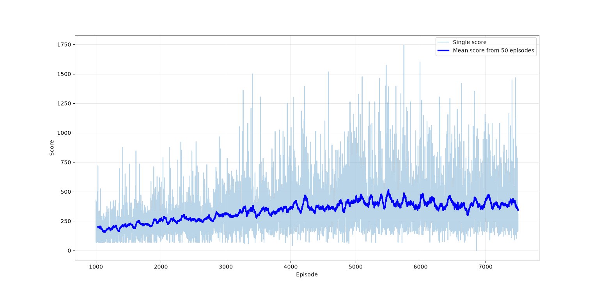

# Subway Surfers AI

A Deep Q-Network agent that learns to play Subway Surfers from raw gameplay, trained entirely through trial and error. Without human demonstration or imitation learning involved.

## Overview

This project trains a reinforcement learning agent to play Subway Surfers by observing game frames and choosing actions to avoid obstacles and survive as long as possible. The agent learns a policy purely through self-play: it starts with no knowledge of the game and improves over time based on rewards received from its own actions.

## Approach

- **Algorithm:** Deep Q-Network (DQN)
- **Perception:** A convolutional neural network (CNN) processes raw game frames to extract spatial features and estimate Q-values for each possible action
- **Learning:** The agent updates its policy using [experience replay / target network / epsilon-greedy exploration — fill in whichever you actually used]
- **Training signal:** Reward based on each step it survives

## Project Structure

| File | Description |
|---|---|
| `environment.py` | Captures game state/frames and translates agent actions into game inputs |
| `Net.py` | CNN architecture used to approximate Q-values from game frames |
| `Agent.py` | Agent logic  |
| `train.py` | Main training loop that runs episodes and updates the agent's policy |

## Installation

```bash
git clone https://github.com/0miorts/subw-AI-surfer.git
cd subw-AI-surfer
pip install -r requirements.txt
```

## Usage

```bash
python train.py
```

## Results
The agent was trained for a little over 7500 games/episodes. The plot below shows each individual score (light blue bar) as well as mean score from 50 games (dark blue). 

The mean score rises from around 200 at the beginning (episodes from around 1000-1500) up to around 450. Diffrence may not be seen as huge, however top scores increased significantly.
It started from ocasional scores higher than 750 to frequently getting scores above 1000. Top score reached 1744 at episode 5743.

## Future Improvements
I gave up on learning agent without making changes. Learning after episode ~4500 did not make any improvements. Rather than climbing, it began fluctuating. I'll have to implement
some sort of screen recording to make clear decisions on how agent can still be improved.
